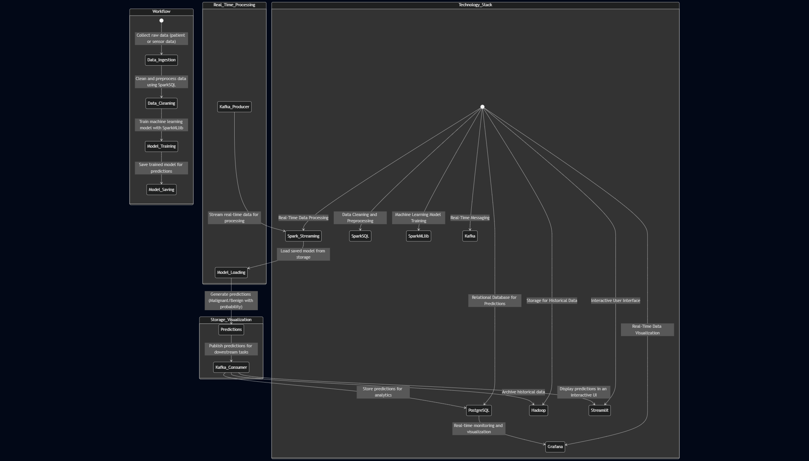
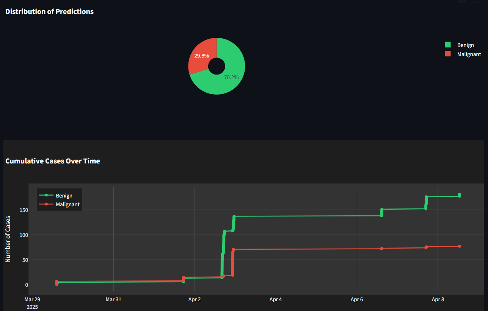
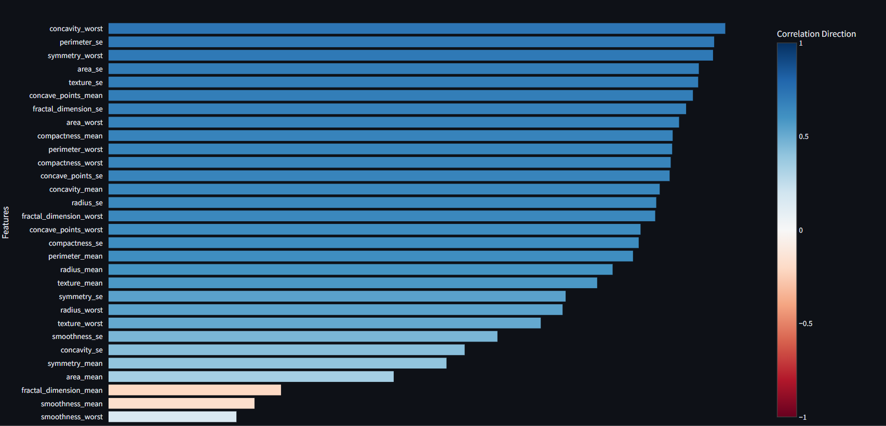
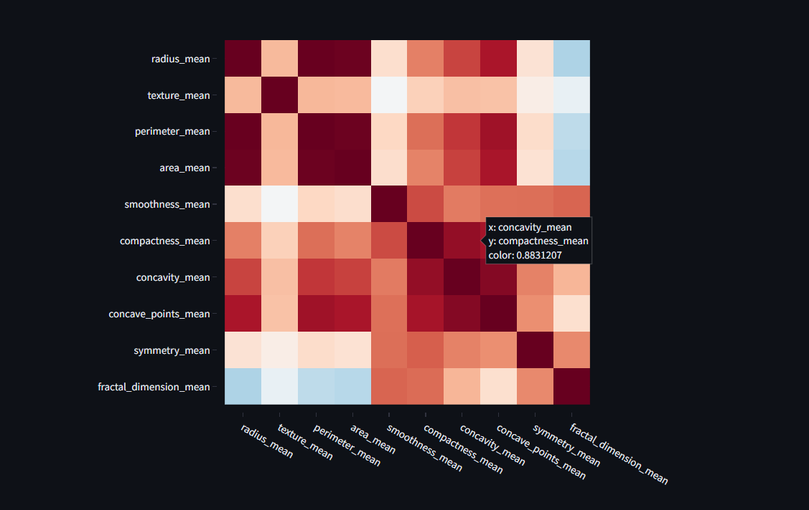
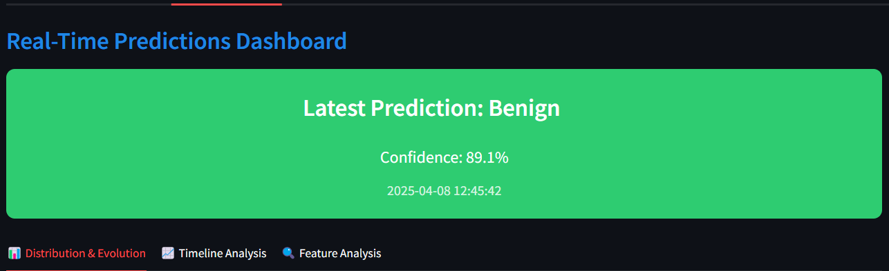
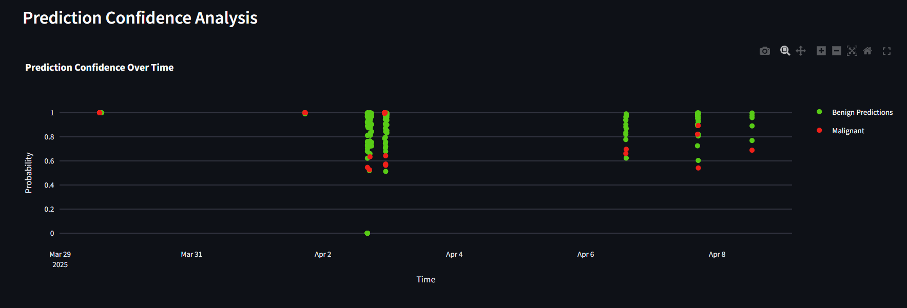
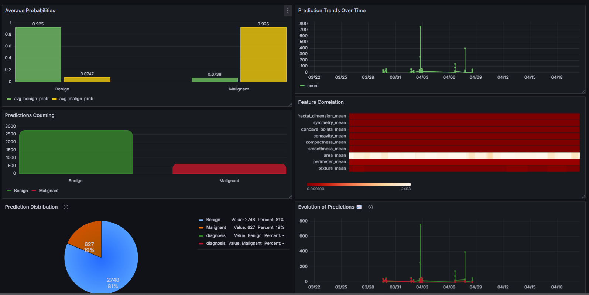
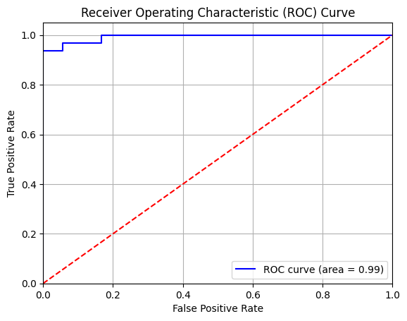

<div align="center">
  

  <p>
    
    
    
    
    
  </p>
</div>

## 🎬 Project Overview

<div align="center">
  
  <p><em>Real-time data flow from medical devices to prediction visualization</em></p>
</div>

This system provides real-time monitoring and early detection of breast cancer using machine learning algorithms. By analyzing medical data streams, it enables healthcare professionals to make timely interventions and improve patient outcomes.

## 🏗️ System Architecture

<div align="center">
  
  
  ### Key Components:
  - **Data Ingestion**: Kafka Producer streams real-time medical data
  - **Processing Layer**: Apache Spark handles data cleaning and ML predictions
  - **Storage Layer**: PostgreSQL for predictions, Hadoop for historical data
  - **Visualization**: Streamlit for UI, Grafana for monitoring
</div>

## 💫 Key Features

<div align="center">
  <table>
    <tr>
      <td align="center">
        
        <br /><strong>Interactive Dashboard</strong>
        <br />Real-time monitoring & visualization
        <br />
      </td>
      <td align="center">
        
        <br /><strong>Feature Importance</strong>
        <br />Key feature analysis & impact
        <br />
      </td>
      <td align="center">
        
        <br /><strong>Advanced Visualizations</strong>
        <br />3D plots & heatmaps
        <br />
      </td>
    </tr>
  </table>
  
  <h3>⚡ System Features</h3>
  <table>
    <tr>
      <td align="center">
        
        <br /><strong>Real-time Monitoring</strong>
        <br />Live predictions & updates
      </td>
      <td align="center">
        
        <br /><strong>Latest Predictions</strong>
        <br />Instant results visualization
      </td>
      <td align="center">
        
        <br /><strong>Advanced Analytics</strong>
        <br />Detailed data insights
      </td>
    </tr>
  </table>
</div>

## 📊 Live Monitoring Dashboard

<div align="center">
    <p style='color:red;font-size:18px;'>This Dashboard provides real-time monitoring of breast cancer predictions and it refreshes every 5 seconds.</p>
    
  
  <table>
    <tr>
      <td align="center">
        
        <br /><strong>Real-time Metrics</strong>
      </td>
      <td align="center">
        
        <br /><strong>Historical Analysis</strong>
      </td>
      <td align="center">
        
        <br /><strong>Alert System</strong>
      </td>
    </tr>
  </table>
</div>

## 🔄 System Data Flow

<div align="center">
  
  <p><em>Visualizing the journey of data through our system pipeline</em></p>
</div>

## 🛠️ Tech Stack

<div align="center">
  <table>
    <tr>
      <td align="center"><br />Python</td>
      <td align="center"><br />Hadoop</td>
      <td align="center"><br />Spark</td>
      <td align="center"><br />Kafka</td>
    </tr>
    <tr>
      <td align="center"><br />Streamlit</td>
      <td align="center"><br />Plotly</td>
      <td align="center"><br />PostgreSQL</td>
      <td align="center"><br />Grafana</td>
    </tr>
  </table>
</div>

## 🚀 Installation & Setup Guide

<div align="center">
  
  <p><em>Visual guide to system setup workflow</em></p>
</div>

### Prerequisites
```bash
Python 3.10+  |  Apache Hadoop 3.3+  |  Apache Kafka 2.8+  |  Apache Spark 3.0+
Streamlit 1.0+  |  Docker  |  PostgreSQL  |  Grafana
```

### Step-by-Step Setup

1. **Clone the Repository**
```bash
git clone https://github.com/yourusername/breast-cancer-monitoring-system.git
cd breast-cancer-monitoring-system
```

2. **Start Docker Containers**
```bash
# Start Hadoop containers
docker start hadoop-master hadoop-slave1

# Start Grafana container
docker start grafana
```

3. **Access Hadoop Master Container**
```bash
docker exec -it hadoop-master bash
```

4. **Start Hadoop and Kafka Services**
```bash
# Start Hadoop services
./start-hadoop.sh

# Start Kafka and Zookeeper
./start-kafka-zookeeper.sh
```

5. **Create Kafka Topics**
```bash
# Create prediction-topic
kafka-topics.sh --create --topic prediction-topic \
                --partitions 3 \
                --replication-factor 3 \
                --bootstrap-server localhost:9092

# Create prediction-results-topic
kafka-topics.sh --create --topic prediction-results-topic \
                --partitions 3 \
                --replication-factor 3 \
                --bootstrap-server localhost:9092

# Verify topics creation
kafka-topics.sh --list --bootstrap-server localhost:9092
```

6. **Start Spark Streaming**
```bash
# Navigate to project directory
cd /root/myproject/kafka_to_streamlit

# Submit Spark Streaming job
spark-submit --jars /root/myproject/postgresql-42.6.0.jar \
             --packages org.apache.spark:spark-sql-kafka-0-10_2.12:3.5.1 \
             SparkStreaming.py
```

7. **Run Kafka Producer**
```bash
# In a new terminal
python KafkaProducer.py
```

8. **Launch Streamlit Application**
```bash
# In a new terminal
streamlit run App.py
```

### 📊 Accessing Services

- **Hadoop NameNode**: http://localhost:9870
- **YARN ResourceManager**: http://localhost:8088
- **Grafana Dashboard**: http://localhost:3000
- **Streamlit App**: http://localhost:8501

### ⚠️ Troubleshooting

If you encounter issues:

1. Check if all containers are running:
```bash
docker ps
```

2. Verify Kafka broker status:
```bash
kafka-broker-api-versions.sh --bootstrap-server localhost:9092
```

3. Check Kafka logs:
```bash
cat /var/log/kafka/server.log
```

4. Ensure proper permissions:
```bash
chmod +x start-hadoop.sh
chmod +x start-kafka-zookeeper.sh
```

## 📈 Performance Metrics

<div align="center">
  
  <p><em>System performance and accuracy metrics</em></p>

  <table>
    <tr>
      <th>Metric</th>
      <th>Value</th>
      <th>Description</th>
    </tr>
    <tr>
      <td>Accuracy</td>
      <td>96.8%</td>
      <td>Overall prediction accuracy</td>
    </tr>
    <tr>
      <td>Precision</td>
      <td>95.2%</td>
      <td>Positive predictive value</td>
    </tr>
    <tr>
      <td>Recall</td>
      <td>94.7%</td>
      <td>True positive rate</td>
    </tr>
    <tr>
      <td>F1 Score</td>
      <td>94.9%</td>
      <td>Harmonic mean of precision and recall</td>
    </tr>
    <tr>
      <td>Latency</td>
      <td><200ms</td>
      <td>End-to-end processing time</td>
    </tr>
  </table>
</div>

## 👨‍💻 Author

<div align="center">
  
  
  <h3>Aimad Bouya</h3>
  <p>AI & Data Engineering Student</p>
  
  <p>
    <a href="https://www.linkedin.com/in/aimad-bouya/">
      
    </a>
    <a href="https://github.com/itsAimad">
      
    </a>
    <a href="https://twitter.com/itsAimad">
      
    </a>
  </p>
</div>

<div align="center">
  
  <br/>
  
</div> 